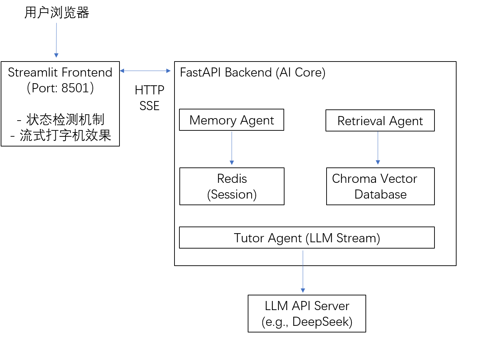

# 🤖 AI 物理辅导 Agent (AI Physics Tutor)

      一个基于多智能体（Multi-Agent）架构与 RAG（检索增强生成）技术的初中物理辅导系统。该系统不仅具备知识问答能力，更能像真实教师一样，通过苏格拉底式提问引导学生独立思考。

# ✨ 核心亮点 (Highlights)

      🧠 多智能体协作架构：采用 Memory Agent（记忆管理）、Retrieval Agent（知识检索）和 Tutor Agent（启发式辅导）分工协作，实现复杂的业务逻辑解耦。

      ☁️ 云原生工程化部署：彻底告别单体架构，采用前后端分离设计，全面容器化（Docker Compose），支持独立扩缩容。

      ⚡ 极致的用户体验 (UX)：针对大模型冷启动慢的痛点，设计了优雅的前端状态检测与降级机制，提供丝滑的交互体验。
      
      💾 智能缓存与记忆：集成 Redis 实现会话历史管理，结合 Chroma 向量数据库实现本地知识库的高效检索。

# 🏗️ 系统架构图 (Architecture)

# 🛠️ 技术栈 (Tech Stack)

#### - 前端
  
      Streamlit
      Requests (SSE 流式解析)

#### - 后端
  
      FastAPI
      Uvicorn
      LangChain

#### - AI 模型
  
      DeepSeek (LLM)
      Zhipu (Embeddings)
      BGE-Reranker (重排模型)

#### - 存储与缓存

      Redis (会话管理)
      ChromaDB (向量检索)

#### - 部署

      Docker
      Docker Compose
      环境变量隔离

# 🚀 快速启动 (Quick Start)

本项目已完全容器化，只需三步即可在本地运行：

#### - 配置环境变量
      
      在项目根目录创建 .env 文件，填入你的 API Key：DASHSCOPE_API_KEY=your_api_key_here

#### - 一键启动服务
  
      docker compose up -d --build

#### - 访问应用
      
      打开浏览器访问：http://localhost:8501

# 💡 工程化实践笔记 (Engineering Practices)

### 💬 为什么采用前后端分离？

      早期版本将 Streamlit 和 FastAPI 放在同一个容器中，导致日志混杂、资源争抢。解耦后，前端和后端可以独立迭代。例如，前端增加加载状态检测时，只需重建前端镜像，后端服务完全不受影响。

### 💬　如何解决大模型冷启动导致的体验断层？

      大模型加载通常需要几十秒。如果前端不做处理，用户会看到长时间的白屏或超时错误。本项目在后端增加了 /health 探针接口，前端在每次交互前进行“敲门”检测。若后端未就绪，前端会展示优雅的加载提示
      并禁用输入，彻底杜绝了报错，提升了系统的鲁棒性。

